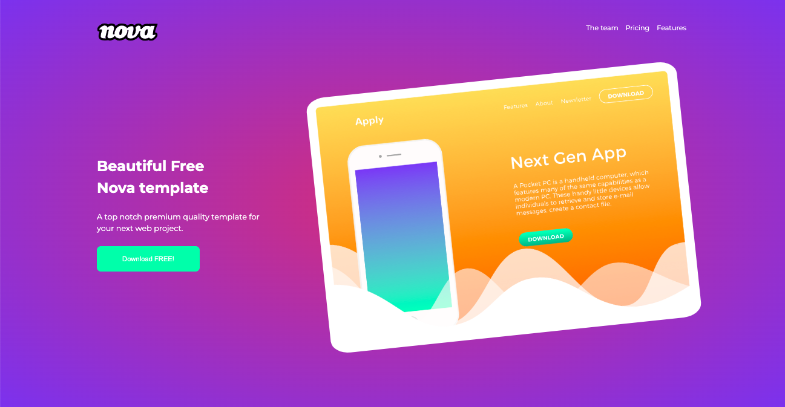

# Thanks for viewing my Project ✨

 

## :star: Live Deployment: (https://katarzynadworak.github.io/online-shop/)
 

## Main goal of my work was to:
- Develop a **Visually Appealing Template**: Create a high-quality, premium-looking template suitable for a wide range of web projects, focusing on aesthetics and modern design principles.
- Provide a **highly customizable template**, allowing users to easily change colors, images, and sections to suit their specific needs.
- Incorporate **Smooth User Interactions**: Utilize CSS transitions and animations to enhance user interactions, ensuring a smooth and engaging experience. Utilize Clean and Organized Code:
- Follow **the BEM (Block Element Modifier) methodology for writing clean, modular, and maintainable HTML and CSS code**.
- Apply **Modern Design Techniques**: Use modern design techniques such as radial gradients, shadows, and flexible grid layouts to create an attractive and functional interface.
- Ensure **Cross-Browser Compatibility**: Implement CSS properties and techniques that are compatible across different browsers, ensuring a consistent user experience.
- **Integrate External Fonts and Icons**: Incorporate Google Fonts and custom icons to enhance the visual appeal and readability of the template.
 

## Solutions provided in the project
1. **Responsive Grid Layout with CSS Grid** My code snippet demonstrates the ability to create responsive layouts using CSS Grid. This layout adapts to different screen sizes, which is crucial in modern web design.

  .header__container-2 {
    display: grid;
    grid-template-columns: repeat(auto-fill, minmax(200px, 1fr));
    gap: 20px;
    align-items: center;
    padding: 50px 0;
  }

  .header__description {
    grid-column: span 2;
  }

  .header__img {
    justify-self: center;
    max-width: 100%;
    height: auto;
  }

**2. Interactive Transitions and CSS Animations** My code illustrates adding interactive transitions and animations to enhance user interaction. The example shows a button animation.

 .header__btn {
    background-color: #59fea6;
    color: white;
    border: 0;
    border-radius: 7px;
    width: 170px;
    padding: 15px 10px;
    font-size: 0.7em;
    transition: background-color 0.3s, transform 0.3s;
 }

 .header__btn:hover {
    background-color: #45c58b;
    transform: scale(1.05);
 }

**3. Customization and Modularity** My code snippet shows how to enable easy customization of a template by users through CSS variables and modular code.

 :root {
    --primary-color: #59fea6;
    --secondary-color: #58D5F7;
    --background-color: #F9FAFA;
    --text-color: #464646;
 }

 .header {
    background: radial-gradient(rgb(194, 74, 126), rgb(105, 86, 235));
    color: var(--text-color);
 }

 .header__btn {
    background-color: var(--primary-color);
    color: white;
 }

**4. Advanced Use of Flexbox for Page Layouts** The code snippet demonstrates advanced use of Flexbox to create flexible and well-organized page layouts.

 .team__members {
    display: flex;
    justify-content: center;
    flex-wrap: wrap;
    gap: 20px;
 }

 .team__member {
    display: flex;
    flex-direction: column;
    align-items: center;
    padding: 20px;
    background-color: white;
    border-radius: 10px;
    box-shadow: 0 4px 8px rgba(0,0,0,0.1);
 }

 .team__members--icons {
    display: flex;
    justify-content: center;
    gap: 10px;
 }

 
 

## Responsywny projekt? <LINK>

## 🛠️ Languages and Tools used: 

 
 
 
 

## :blue_heart:  You can find me on:
 

 
 

### Thanks
To Colorlib [colorlib.com](https://colorlib.com) for free templates.
